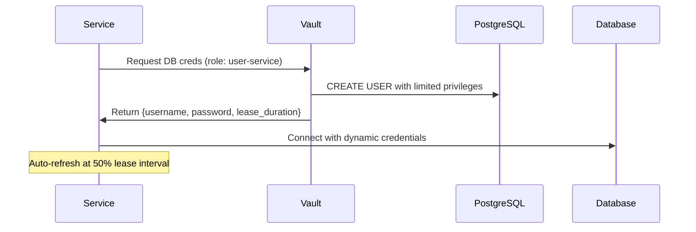

# Security Architecture

## Threat Model

| Threat | Mitigation |
|--------|-----------|
| Unauthorized API access | API key authentication via Envoy ext-authz |
| Inter-service eavesdropping | mTLS with TLS 1.3, ECDSA P-256 |
| Database credential leak | Vault dynamic credentials (auto-rotated) |
| Container escape | Distroless images, read-only FS, no-new-privileges |
| Network lateral movement | Docker network segmentation (frontend/backend) |
| Injection attacks | Prepared statements (pgx), input validation at gRPC layer |
| Secrets in git | .gitignore for certs/, .env* patterns |
| Certificate compromise | 11-month rotation cycle, emergency rotation procedure |

## mTLS Implementation

### Certificate Authority
- Custom CA using cfssl (CloudFlare's PKI toolkit)
- ECDSA P-256 keys (smaller certs, better perf than RSA)
- 10-year CA validity period
- CA key stored locally in `certs/ca/` (never committed)

### Service Certificates
- 1-year validity per service certificate
- Three signing profiles: `server`, `client`, `peer` (mutual TLS)
- All service certs use `peer` profile: both `serverAuth` + `clientAuth` EKU
- SANs include: `localhost`, `<service-name>`, `127.0.0.1`

### Certificate Layout
```
certs/
├── ca/               # CA certificate + key
├── user-service/     # user-service cert + key
├── order-service/    # order-service cert + key
└── api-gateway/      # Envoy client cert + key
```

### Verification
```bash
# Verify certificate chain
openssl verify -CAfile certs/ca/ca.pem certs/user-service/cert.pem

# Test mTLS handshake
echo | openssl s_client -connect localhost:50051 \
  -cert certs/api-gateway/cert.pem \
  -key certs/api-gateway/key.pem \
  -CAfile certs/ca/ca.pem
```

### Rotation Procedure
See `certs/cert-rotation.md` for:
- Planned rotation (11-month cycle, staggered)
- Emergency rotation (compromised key, immediate)
- Expiry monitoring commands
- Docker secrets deployment reference

## Secrets Management

### HashiCorp Vault
- Running as a Docker container (hashicorp/vault:1.15)
- Raft storage backend for development
- Dynamic database credentials via `database/` secret engine
- Static secrets via KV v1 at `secret/`

### Dynamic DB Credentials


### Service Token Files
- `vault/tokens/user-service.token` — token for user-service
- `vault/tokens/order-service.token` — token for order-service
- Mounted as Docker secrets volumes (read-only)
- One token per service, scoped via Vault policies

### Vault Policies
- `user-service` policy: read `database/creds/user-service`, read/list `secret/user-service/*`
- `order-service` policy: read `database/creds/order-service`, read/list `secret/order-service/*`

## Network Security

### Docker Network Segmentation
```
frontend (172.x.0.0/16)     backend (172.x.0.0/16)
┌──────────────┐            ┌──────────────────┐
│    Envoy     │◄──────────►│  user-service    │
│  ext-authz   │            │  order-service   │
└──────────────┘            │  user-db         │
                            │  order-db        │
                            │  redis           │
                            │  vault           │
                            │  prometheus      │
                            │  grafana         │
                            │  jaeger          │
                            └──────────────────┘
```

### Port Exposure (host-accessible)
| Port | Service | Purpose |
|------|---------|---------|
| 8080 | Envoy | HTTP API gateway |
| 50051 | user-service | gRPC (direct) |
| 50052 | order-service | gRPC (direct) |
| 3000 | Grafana | Dashboard UI |
| 9090 | Prometheus | Metrics |
| 16686 | Jaeger | Tracing UI |
| 8200 | Vault | Secrets UI |

## Application Security

### Input Validation
All gRPC endpoints validate input before processing:
- Required fields checked (empty strings → `InvalidArgument`)
- Email format validated (must contain `@`)
- Numeric ranges enforced (quantity > 0, unit_price >= 0)
- FieldMask paths validated (only `name` and `email` allowed)
- Max page_size clamped to 100

### Error Handling
- Internal errors logged but never exposed to the client
- gRPC status codes used consistently:
  - `InvalidArgument` — request validation failure
  - `NotFound` — resource does not exist
  - `AlreadyExists` — duplicate email/unique constraint
  - `Internal` — unexpected server error (details not leaked)

### SQL Injection Prevention
- All database queries use parameterized statements via pgx
- No string concatenation for query values
- Dynamic SET clauses use parameterized placeholders

## Container Security
- **Base images**: `gcr.io/distroless/static-debian12:nonroot` (no shell, no package manager)
- **User**: `1000:1000` (non-root) in all services
- **Root filesystem**: read-only (`read_only: true`)
- **Privileges**: `no-new-privileges:true`
- **Tmp dirs**: writable `tmpfs: [/tmp]` for runtime temp files
- **No secrets in images**: all secrets injected at runtime via volumes/environment

## Security Scan Results
Security scanning via trivy/grype has not been integrated yet (planned for Phase 2 CI/CD pipeline). Current mitigations rely on minimal base images and runtime security hardening.
